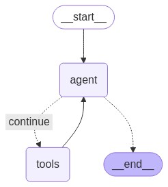

# Langchain Basic Agent

This repository demonstrates a Langchain Agent implemented in **TypeScript**. It integrates **LLM (Large Language Models)**, and **SearchAPI** to create a powerful and flexible agent capable of reasoning, acting, and observing.

## Overview

Langchain Agents are designed to handle complex workflows by combining reasoning and action-taking capabilities. This implementation follows the **ReAct** (Reasoning + Acting) architecture:

1. **Act** - Take an action based on the current state.
2. **Observe** - Capture the response from the action.
3. **Reason** - Analyze the response and decide the next steps.

The agent can interact with external APIs, process data, and make decisions dynamically.

## Features

- **TypeScript**: Strongly typed implementation for better maintainability.
- **LLM Integration**: Leverages large language models for reasoning and decision-making.
- **SearchAPI**: Enables the agent to fetch and process external information.

## Getting Started

### Prerequisites

Ensure you have the following installed:

- Node.js (>= 16.x)
- npm (>= 7.x)

### Installation

1. Clone the repository:

    ```bash
    git clone https://github.com/your-username/langchain-basic-agent.git
    cd langchain-basic-agent
    ```

2. Install dependencies:

    ```bash
    npm install
    ```

### Running the Service

To start the agent service, run:

```bash
npm run start
```

The service will be available at `http://localhost:3000`.

### Example Usage

You can interact with the agent by sending requests to the REST API. For example:

```bash
curl -X POST http://localhost:3000/agent -H "Content-Type: application/json" -d '{"query": "What is the capital of France?"}'
```

The agent will process the query, fetch relevant information, and respond accordingly.

## Architecture Diagram

Below is a high-level architecture diagram of the Langchain Agent:



## Tutorial

For a step-by-step guide on building Langchain Agents, refer to the [official tutorial](https://langchain-ai.github.io/langgraphjs/tutorials/quickstart/#langsmith).

## Contributing

Contributions are welcome! Please fork the repository and submit a pull request with your changes.

## License

This project is licensed under the MIT License. See the [LICENSE](./LICENSE) file for details.

